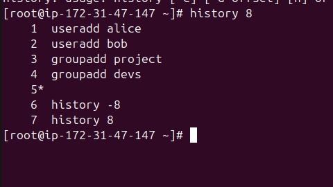
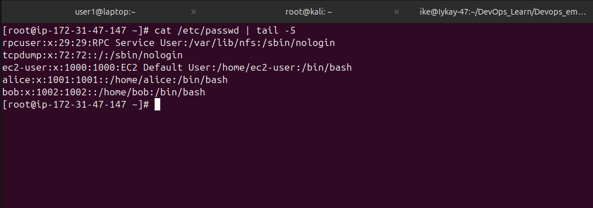
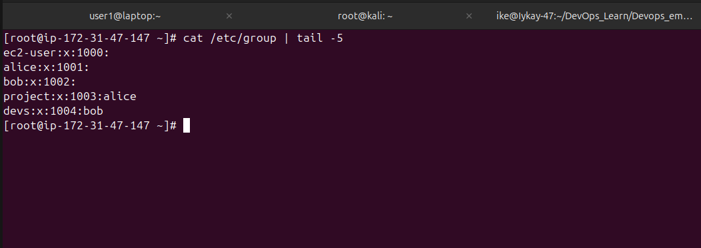
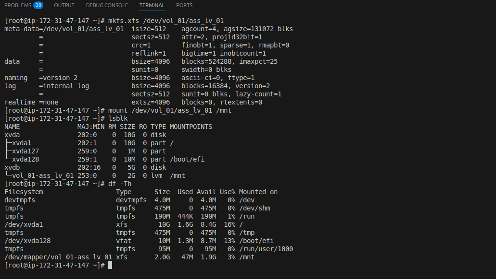

Create 2 users
    useradd bob
    useradd alice

Verify user created in /etc/passwd
    cat /etc/passwd | tail -5

Change password for both users
    passwd bob
    passwd alice

Change some password settings
    chage bob
    chage alice 

Sign-in to make sure password was set properly
    su - bob
    su - alice

Create New groups
    groupadd project
    groupadd devs

Verify user and group creation
    cat /etc/passwd | tail -5
    cat /etc/group | grep -5

Create passwords for users
    passwd alice    # Enter desired password upon prompt
    passwd bob

Login 
    su - alice
    su - bob

Add users to groups
    usermod -aG project alice
    usermod -aG devs bob

Verify group addition by viewing /etc/group file
     cat /etc/group | tail -5 

Remove alice from project
    gpasswd -d alice project

 Verify user removal
    cat /etc/group | tail -5        # bob no longer part of devs group

Adding Volume in AWS
    > EBS 
    > Volume 
    > Create Volume # Make sure volume is in same region as ec2 instance
    > Attach Volume to Ec2-instance 

Check list blocks identify new storage
    lsblk

Mark new storage as Physical Volume
    pvcreate /dev/sdd

Create Volume group
    vgcreate volg_01 /dev/sdb

Create Logical Volume
    lvcreate -n ass_lv_01 -L 2G vol_01  #Create 2G logical volume from the 5G volume group 

Make filesystem on Volume
    mkfs.xfs /dev/vol_01/ass_lv_01

Mount new file system to /mnt
    mount /dev/vol_01/ass_lv_01 /mnt

Make mount psersistent
    sudo echo "/dev/vol_01/ass_lv_01    /mnt    xfs defaults    0   0" >> /etc/fstab
    # Using the UUID is a better option

    mount -a    # Mount all files in fstab

Verify
    lsblk   # List block devices
    df -Th  # List disk usage status as well as filesystem types

