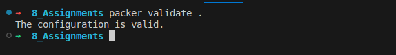
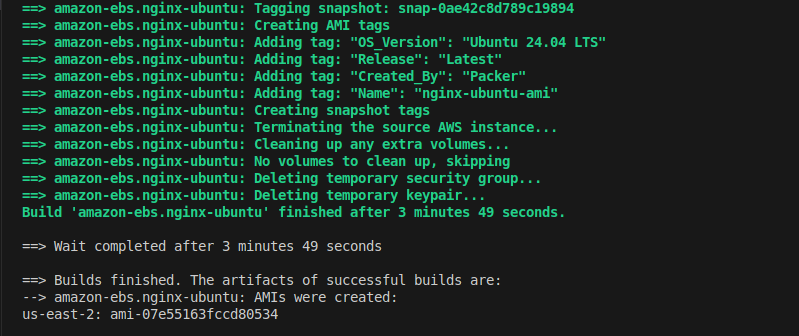
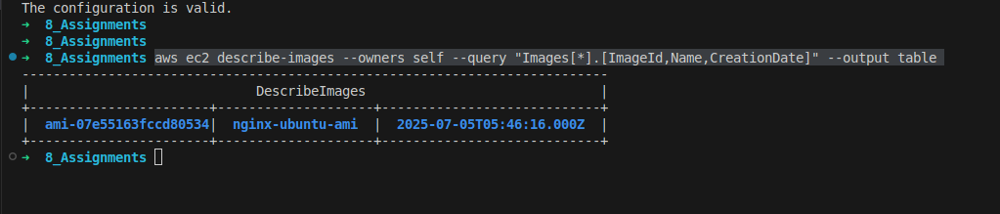
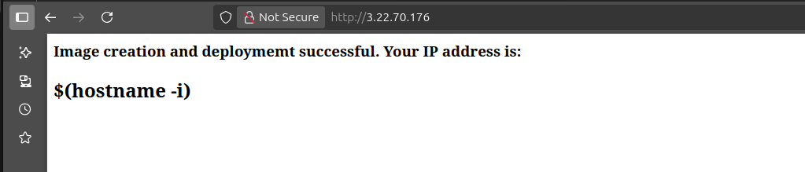
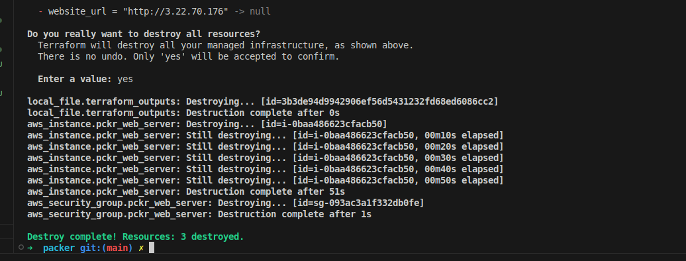

The goal of this assignment is to use packer to build an ami which is reuseable in AWS to spin up instances and Terraform to provision infra.

### Pre-Requisuites:
  - Aws CLI installed and configured with user with the permissions create and manage ec2 ami i.e write and read permissions on ec2.
  - Packer Installed.

### Workflow:
  - Get base AMI from Aws # Make sure region matches
  - Configure AMI to install and enable Nginx
  - Setup default web page to output success message by writing to /var/www/html
  - Build AMI
  - Use AMI to spin up instance.
  - Config terraform to spin up instance including:
    - Security group config allows inbound traffic.
    - VPc and Internet gateway or just leave blank to use default.
  - Validate web_server setup by visiting the public IP in browser.

After writing config file to specify the image you want to build,

    Validate the config file

  >packer validate .

 Then build image

  >packer build amzn-ubuntu-ami.pkr.hcl

Output without issues should look like this:

> Get the ami-07e55163fccd80534

Also Validate by Checking your AWS console or running

  >aws ec2 describe-images --owners self --query "Images[*].[ImageId,Name,CreationDate]" --output table

  

Create and configure a terraform file to automatically deploy.

#### Initialize Terraform
  
  >terraform init

#### Validate terraform code
  
  >terraform validate
  
#### Dry test code to see possible changes
  
  >terraform plan

#### Apply/Deploy code 
  
  >terraform apply
  > enter yes

Validate config by visiting public-ip of the instance created.

### Clean-up

#### Terminate Instances using terraform

  >terraform destroy
  
  

> Get AMI Id and Snapshot id

#### Deregister ami 

  >aws ec2 deregister-image --image-id <ami-1234567890abcdef0> # input packer ami id that was created.

#### Delete snapshot associated to AMI
  >aws ec2 delete-snapshot --snapshot-id <snap-1234567890abcdef0>

#### Future projects.
Figure a away to get packer to output AMI-ids and snapshot ids to local machine